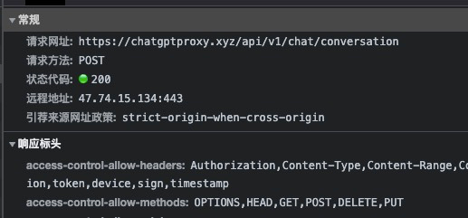
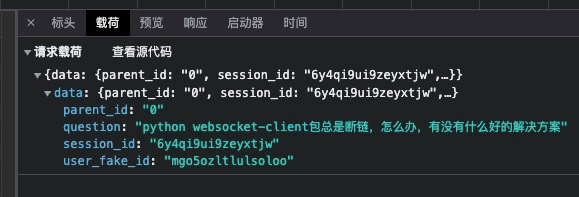
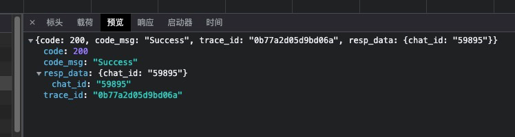

## 代理 [https://chatgptproxy.xyz](https://chatgptproxy.xyz)

之所以写这个项目，也是发现这个网站的API，貌似并没有设防

##### 发起对话请求的接口：https://chatgptproxy.xyz/api/v1/chat/conversation

这个接口可以发起对话，具体的参数如下

```javascript
// conversation的参数如下
{
  "data": {
    "parent_id": "", // 这个是对话的衔接的key，上下文对应的，这一句话返回的chat_id 为下一句话的parent_id
    "question": "",  // 问题内容
    "session_id": "", // 这个在整个对话过程中，都没有变，通过setRandomNumberWay()生成的随机字符串，每次刷新页面都会生成
    "user_fake_id": "" // 用户ID，也是通过setRandomNumberWay()生成的字符串，localStorage存储在了本地，应该是用户固定的ID
  }
}

setRandomNumberWay: function() {
    for (var t, e = ["0", "1", "2", "3", "4", "5", "6", "7", "8", "9", "a", "b", "c", "d", "e", "f", "g", "h", "i", "j", "k", "l", "m", "n", "o", "p", "q", "r", "s", "t", "u", "v", "w", "x", "y", "z"], n = "", a = 0; a < 16; a++)
        t = Math.floor(36 * Math.random()),
            n += e[t];
    return n
}

// 获取的结果内容里面，可以提取对应的chat_id
{
    "code":200,
    "code_msg":"Success",
    "trace_id":"0b77a2d05d9bd06a",
    "resp_data":{
        "chat_id":"59895"
    }
}

```






##### 获取结果接口：https://chatgptproxy.xyz/api/v1/chat/result

这个接口获取对话的结果，需要循环调用，最后通过status判断结果

```javascript
具体的 js 判断函数 getChatResultWay
可见 
1. 生成中，遇到了，继续sleep，之后调用即可
2. console.log("答案给了一半，之后就不再返回了") 测试中没有遇到过，但js代码可以发现，这里直接截止了，再次发起conversation得
3. 正常返回成功，显示结果，不再继续调用result接口
5. ChatGPT限速中，正在重试～, 后面继续调用result接口
else. 过滤了
```

具体参数如下：
```javascript
// result接口的参数
{
    "chat_id": "", // conversation接口获取的chat_id
    "user_fake_id": "", // 同上
    "session_id": "" // 同上，一样的方法，上面创建了，后面可以直接用
}
// 获取的结果内容里面，可以提取对应的answer
// 这个接口，每隔一秒就调用一次，异步获取结果，最后一次的status==3
// 查看js，getChatResultWay() 这个方法，实际上还有其他的值，貌似其他的都是错误提示
{
    "code":200,
    "code_msg":"Success",
    "trace_id":"3d4b07d033716dbd",
    "resp_data":{
        "answer":"WebSocket是一种协议，用于在客户端和服务器之间进行实时通信。WebSocket客户端可以使用Python的websocket-client包来实现。\n\n如果websocket-client包总是断开连接，可能是以下一些原因导致：\n\n1. 服务器端连接断开：WebSocket需要服务器端和客户端之间建立连接，如果服务器端关闭了连接，客户端也会断开连接。您需要检查服务器端的日志以查看是否有任何异常或错误，以及处理服务器端的连接中断情况。\n\n2. 网络问题：WebSocket连接需要良好的网络连接，如果您的网络不稳定，可能会导致WebSocket连接断开。您可以尝试重新连接，或者检查您的网络连接是否正常。\n\n3. 客户端问题：WebSocket客户端的问题也可能导致连接断开。您可以尝试更新websocket-client包到最新版本，并查看是否有任何错误或异常消息。\n\n下面是一些解决方案：\n\n1. 检查服务器端：检查服务器端是否在运行，并且没有异常或错误。您可以尝试重新启动服务器，或者查看服务器端的日志以获取更多信息。\n\n2. 检查网络连接：检查您的网络连接是否正常，并确保WebSocket客户端可以访问服务器端。\n\n3. 更新websocket-client包：尝试更新websocket-client包到最新版本，以查看是否有任何错误或异常消息。您可以使用pip安装或升级websocket-client包，如下所示：\n\n   ```\n   pip install --upgrade websocket-client\n   ```\n\n4. 添加重连逻辑：在您的WebSocket客户端代码中添加重连逻辑，以便在连接断开时自动重新连接。您可以使用以下代码片段作为示例：\n\n   ```\n   import websocket\n   import time\n\n   def on_close(ws):\n       print(\"### closed ###\")\n       time.sleep(5)\n       ws.connect(\"ws://localhost:8080/\")\n\n   def on_error(ws, error):\n       print(error)\n\n   def on_message(ws, message):\n       print(message)\n\n   def on_open(ws):\n       print(\"### opened ###\")\n\n   if __name__ == \"__main__\":\n       websocket.enableTrace(True)\n       ws = websocket.WebSocketApp(\"ws://localhost:8080/\",\n                                   on_message = on_message,\n                                   on_error = on_error,\n                                   on_close = on_close)\n       ws.on_open = on_open\n       ws.run_forever()\n   ```\n\n   该代码片段将在连接断开时等待5秒钟，然后自动重新连接。您可以根据自己的需要进行调整。\n\n希望这些解决方案可以帮助您解决WebSocket连接断开的问题。",
        "status":3
    }
}

```

##### 心跳接口: https://chatgptproxy.xyz/api/v1/chat/heart

心跳接口，每10秒调用一次，开始的时候，没有在乎，后来发现，没有心跳，整个对话过程，虽然参数能对应上，但不能连贯，无法上下文衔接

具体参数如下：
```javascript
// heart接口参数
{
  "user_fake_id": "", // 如上，不解释
  "session_id": "" // 如上，不解释
}
// 结果，貌似从来没变过
{"code":200,"code_msg":"Success","trace_id":"c7ae13c0bc237d4f","resp_data":null}
```

##### 点赞接口：https://chatgptproxy.xyz/api/v1/chat/label

这个接口，对于使用本项目的同学，貌似没啥用，虽然分析了对应的参数，但，懒得写，哈哈哈哈

## 声明

公开这种代理，是为了大家更好的在其中学习和高效率的工作，请勿进行非法活动，您应该对自己的行为负责，一切责任与无我关

侵权必删
